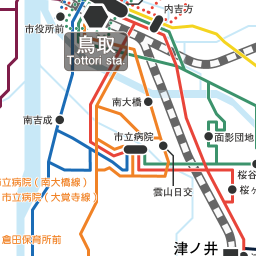
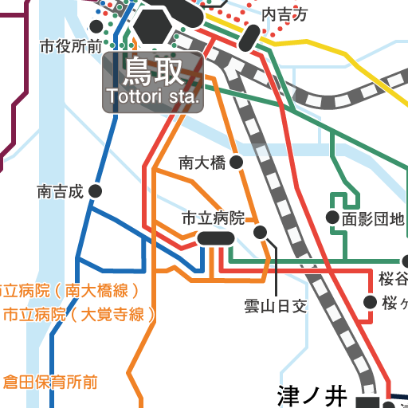

# illustrator-to-MapTiles






## illustrator-to-MapTilesについて
Adobe Illustratorの拡張スクリプトです

## 特徴
1. illustratorから、ZXY方式の地図タイル画像を直接出力
1. 適切なフォルダに分けて出力
1. 出力タイルサイズは256px以外にも対応
1. 背景の透過ON/OFFも設定可能
1. ただし、処理が非常に重い……
    - illustratorの仕様です、改善の見込みはありません

## 地図タイルの元データ制作時の注意
1. 予め地図タイルにあわせた形でデータを作成している必要があります
1. ***制作時の左上のXYタイル座標***と、***制作時にあわせた地図タイルのズームレベル***があればOK
    - 必要なのはz,x,y,z'の4つ
    - z,x,yは制作しているIllustratorの設計データ
    - z'は出力したいズームレベル
1. もちろん、***スクリプト実行前のバックアップをお忘れなく***
    - 編集履歴の汚染が発生します、編集前の状態に戻れません

# 動作環境
- Adobe Illustrator CC 2020他
    - CC2018では動いていました

---------------------------------------------

# バージョン履歴
[CHANGELOG.md](./CHANGELOG)に移動

---------------------------------------------

# 前提条件
- zxy方式の地図タイルに基づくIllustratorデータを作成している
- 制作データは、地図タイルに合わせられている
- 出力範囲全体がちょうど収まるアートボードがある
- ベースにある地図タイルのズームレベルを把握している
    - 256pxのz15地図タイルを512pxにして配置していた場合、z16とみなす
- 出力範囲左上のタイル座標(x,y)を把握している
    - 例えば国土地理院にはタイル座標確認サイトが。
    - [https://maps.gsi.go.jp/development/tileCoordCheck.html](https://maps.gsi.go.jp/development/tileCoordCheck.html)
    - どこかにメモをとっておくことを推奨

---------------------------------------------

# 導入方法・使い方
1. スクリプトを実行したいIllustratorデータを開く
1. 本githubの"ai2tiles.jsx"をRAWから名前を付けて保存する
1. PC内のどこかに"ai2tiles.jsx"を配置する
    - 例えば、adobe既定のスクリプト保管フォルダ
1. ***スクリプト実行前のIllustratorデータを保存します***
1. スクリプト実行前に、出力範囲全体がちょうど収まるアートボードを選択する
    - このスクリプトでは、選択されたアートボードに基づいて出力します
1. ファイル->スクリプトからPC内にあるai2tiles.jsxを指定、実行する
1. 入力画面で必要事項を入力する
    - スクリプトを実行したいデータのz,x,yを入力する
    - 実行後に出力したいズームレベルを4つ目に入力する
    - タイルの背景を透過させる場合は☑(チェック)を入れる
1. OKを押し、ファイル選択ダイアログで出力先を指定する
1. 気長にコーヒーを淹れましょう☕
    - 出力範囲が広いと、当たり前のように数分かかります
1. 出力完了！

---------------------------------------------

# Q & A
## 入力画面での既定値を変更したい
## 256px以外で出力したい

拡張スクリプトの中身を直接弄ってください。一般的なテキストエディタで開くことができます。

拡張スクリプトの序盤に、既定値を設定できる箇所があります。この数値を変えることで、既定値を変更できます。具体的には以下。

```javascript
// ユーザーによるカスタマイズ可能変数
// (1)imgsize : 画像サイズの値(px)
    // ここで決めたサイズの正方形として地図タイルは出力される
    // 内部的には、一旦256でアートボードを用意した後、256とimgsizeの比率で出力画像の倍率を調整する。
var imgsize = 512;

// (2)出力元データの各種既定値
    // つまりZ,X,Y、アートボードのデータ
    // XとYで迷う人向けに。Xはフォルダ名、Yは画像名
    // 因みにこの値は鳥取市の名勝・白兎海岸
var defZ = 15;
var defX = 28590;
var defY = 12918;

// (3)出力先既定Zレベル既定値
    // つまりZ'、出力したい地図タイルのズームレベル
var defZZ = 15;
```

## 制作時よりも低いズームレベルで出力したい

現在は想定外の挙動をするので注意。そのうち改良予定。

## 実行するのに時間がかかる

開発環境で動作確認を行うと、毎秒4枚程度出力されます。PC性能などにより異なりますが、遅いことは間違いないです。

内部的には、一時アートボードを1つ1つ移動して出力しているだけなので、出力枚数に比例して処理時間も伸びます。

加えて、処理を中断できないのもこの拡張スクリプトの難点です。ズームレベルが大きくなると、出力枚数も増えるので、この機能は欲しい所。いずれつけるかも。

## 「戻る」を押すとタイル出力で埋められてしまった
いずれ「戻る」1回でスクリプト実行内容をまとめる予定(UndoModesとdoScriptを使う)


(2020/07/20追記)この「編集汚染」とも呼ぶべき被害は、illustratorの内部仕様で、スクリプト作成者では回避できなさそうです。いずれ他の手段で作業を行えるツールを開発するかも？

---------------------------------------------

# スクリプト内容や開発設計など
[doc/設計.md](./doc/設計.md)を参照

# Copyright
©kotodu

# License
[MIT LICENSE](./LICENSE)

